# 	ORIGINAL SOLARFIDGET - NO BATTERIES INCLUDED EDITION

Using an LED strip (of 32 WS2812B individually addressable LEDs) and an
MPU6050 gyro/accel, this fidget calculates the position of a rotating
pendulum that reacts to acceleration and gravity and simulates the effect
of gravity on different bodies in our solar system (including Pluto).

Concept, Design and Idea **Copyright (C)** 2021, 2022 Kurt Manucredo, under
the CREATIVE COMMONS ATTRIBUTION-NONCOMMERCIAL 4.0 INTERNATIONAL PUBLIC
LICENSE

For more information on Copyright please refer to the respective files and
LICENSE files.


* * *

# 1. MANUAL INSTRUCTIONS

## 1.1 TRAVEL FROM PLANET TO PLANET

You can travel the following bodies in our solarsystem in order:

- Mercury (0.38g)   (white)
- Venus   (0.904g)  (light blue)
- Earth   (1g)      (dark blue)
- Mars    (0.3794g) (red brown)
- Jupiter (2.528g)  (white grey)
- Saturn  (1.065g)  (yellow)
- Uranus  (0.886g)  (violet)
- Neptune (1.14g)   (green)
- Pluto   (0.063g)  (pink)

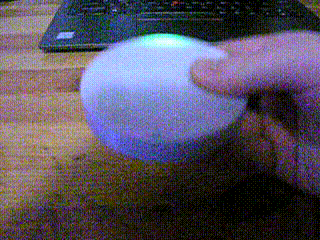\
*To travel from planet to planet hold the fidget horizontally, turn it
twice by 180 degrees. If there is no change, try doing it faster.*
* * *

## 1.2 TURN THE LIGHT ON AND OFF

To turn the fidget on, turn the upper half clockwise. To turn it off, turn
the upper half counter-clockwise.

* * *

# 2. HOW TO BUILD ONE FOR YOURSELF

## 2.1 PARTS NEEDED

- 1x Arduino Nano or compatible
- 1x MPU6050 breakout board
- 1x 5 Volts Voltage-Step-Up-Booster 0.9-5 Volts
- 1x strip of 32 WS2812B individually addressable LEDs (\*)
- 1x 4-pin 6x6x5 push button, 0.4mm push distance
- 1x 3d-printed models of the fidget (\*\*\)
- 3x 0.6x6.5x10 mm compressing spring
- 3x M3 DIN 9021 washer
- single wire 0.5mm diameter
- and a punch of cables one can salvage from old LAN cables or similar.

> (\*):   Use a strip with an LED density of **144 LEDs per metre**.\
> (\*\*): all two parts can be found as .3mf files in the
> design-solarfidget/3mf folder and can be imported directly into the 3d
> slicer software. If you need to make changes to accommodate your own
> hardware, use the solarfidget-aaa.scad file to do so.

## 2.2 OPENSCAD RENDERINGS

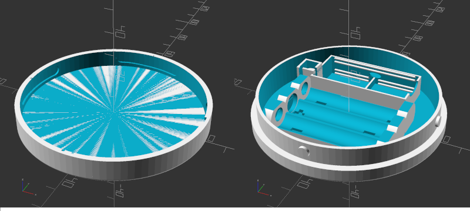\
*Pic. 1: The two parts pictured above compose the solarfidget*
* * *

## 2.3 PRINTING THE PARTS

After printing the parts, let them cool down all the way.

Next, carefully try to close the two parts and turn one part left and right
slowly. If you notice too much resistance open them again and use sanding
paper to sand down the locking towers. Always sand them down just a little
and then try again. If you sand them down too much the whole mechanism may
get too loose. If you sand them down too little it might get impossible to
unlock and open them again.

I've set the towers so that practically no sanding is required. Only some
force is required to repeatedly close, lock, unlock and open them again,
until the process works without much force. But every material is
different. Even one PLA material may differ from another PLA material.

I printed the parts with a **PRUSA i3 MKR3s** printer, used the
**PrusaSlicer 2.4.0 software**, selected **0.20mm QUALITY** print settings
with **30% infill** and used a **transparent PLA material**. I printed the
two parts all in one go. It took about 4 hours.

I recommend transparent PLA material. White PLA works, too. The light,
however, will not be as bright. Any other colour will only let through
**that** colour and make it impossible to distinguish between planets.

Using another material than PLA will likely result in slightly different
dimensions and the electronics being loose or too tight to fit. The fit for
the MPU6050 is particularity crucial and should be very tight to hold it in
place perfectly.

### 2.3.1 Customizing the parts

If you need to make changes to the parts, use the solarfidget-aaa.scad file
to do so. At the beginning of the file, change the dimensions of the
electronic parts, then further down, in the file, adjust the placements for
those parts so that they don't overlap. The electronic parts positions can
be altered in the module named ***electronics***. If you intend to change
the amount of LEDs, remember, you can only change the amount by a
**multiple of 4**.

## 2.4 BUILD INSTRUCTIONS

### 2.4.1 Prepare the Voltage Step Up Module

First, remove the USB plug from the module.

Next, we need to shorten the module a bit.

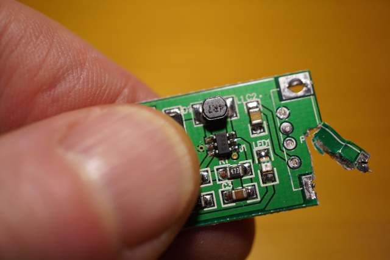\
*Pic. 2: Cut away as much as possible. But don't cut off the USB solder
spots.*
* * *

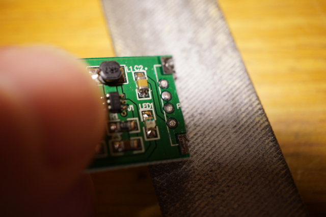\
*Pic. 3: Grind down until short enough.*
* * *

Then remove the remaining tin-solder and remains of the USB plug.

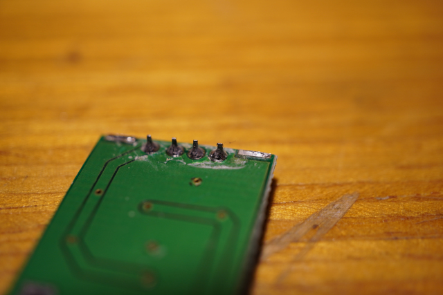\
*Pic. 4: We need to get rid of those four dips on the underside of the
module.*
* * *

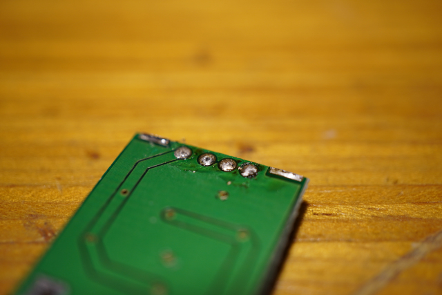\
*Pic. 5: That's what we want! All clean now.*
* * *

### 2.4.2 AAA battery compartment

Cut two pieces of **0.5 diameter blank wire** to the right length and
insert them, one on each side of the batteries compartment. One between the
**Plus (+)** and **Minus (-)**, the other between the **Minus (-)** and
**Plus (+)**.

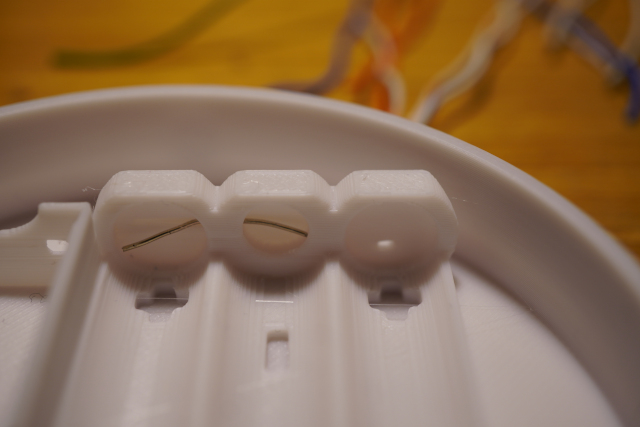\
*Pic. 6: The wire connects the two poles and connects the batteries
serially*
* * *

Next, insert two washers into the two **Plus (+)** poles. Use a M6 key or
something with which you can apply force to get it in. I never managed to
break the plastic. But if you want to make sure, use your thumb to push
against the other side. **Don't** push a third washer into the last
**Plus (+)** pole. We'll do this later.

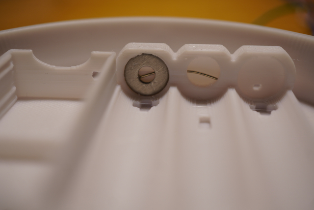\
*Pic. 7: The washers need to sit tight and deep enough to get in contact
with the blank wire.*
* * *

Next, insert two compressing springs into the **Minus (-)** poles. This
might be a bit tricky. Again, **don't** insert the third spring, we'll do
this later.

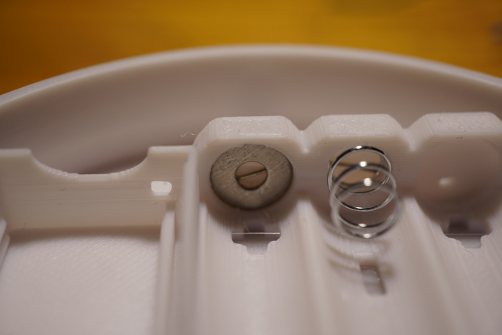\
*Pic. 8: The springs need to sit tight and deep enough to get in contact
with the blank wire.*
* * *

### 2.4.3 Install the Voltage Booster Module

Before we can continue with the rest, we put the **Voltage Booster Module**
in its right place.

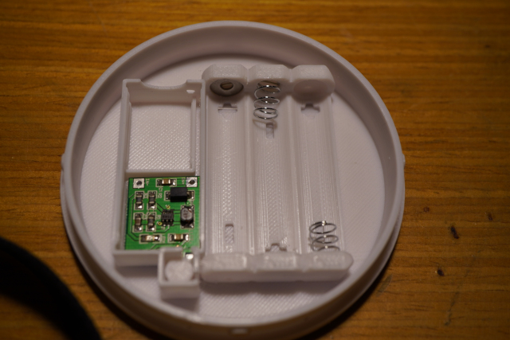\
*Pic. 9: That looks nice!*
* * *

### 2.4.4 Install Push Button

Use a short **0.5 diameter single wire** and strip it on both sides. One
shorter, the other longer. Now, place the longer blank wire into the last
**Minus (-)** pole and push the last spring in there.

Now, take the push button and solder that wire with the shorter blank end
onto one of the terminals, so the circuit will only close if the button is
pushed. Use another wire, solder it to the other terminal and then onto the
**-In** of the **Voltage Booster Module**. Then push the button into its
proper place and make sure its level with the quadratic plastic end.

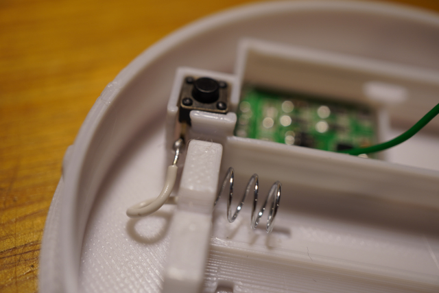\
*Pic. 10: There, last spring installed and wire soldered on. Solder it on
before you push the button in it's place.*
* * *

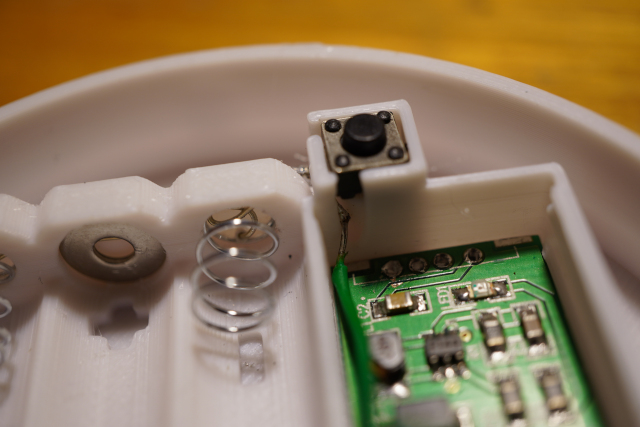\
*Pic. 11: This is the other side. The green cable goes to the* **-In** *of
the* **Voltage Booster Module**.
* * *

Next, we use another wire, strip it again on both sides, one shorter,
one longer and insert it into the last **Plus (+)** pole.

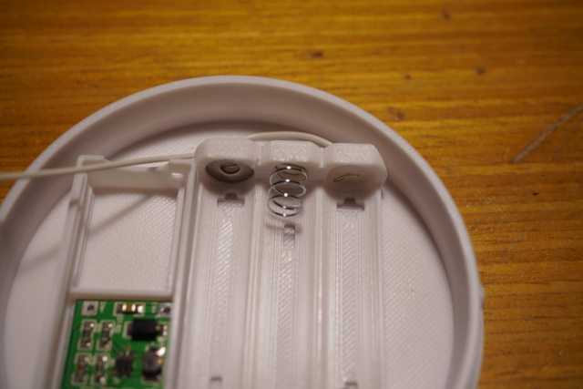\
*Pic. 12: There! Way to go!*
* * *

Then route it through the little hole next to the place where the
**MPU6050** will go. There is place next to the **MPU6050**, so don't route
it over the **MPU6050**. Push the last washer in and solder the wire to the
**Voltage Booster Board** on its **In+** pole.

If this is all done, insert three batteries and test the mechanism. Close
the two parts and try out. If you see the **Voltage Booster Module** light
up, congratulations, you've done it.

If not, the fault may be with the button or the contacts of the batteries
compartment. Push the washers and springs harder in. Then check the button
by pressing it without closing the two parts. Check again with the two
parts closed. If it doesn't work, the button may be too deep inside. Put a
thin plastic or something hard and thin between the button tower and the
button and try to fix it that way.

If it works no matter which way you turn the upper part, when closed, then
the button is too high. Try to grind down the button tower to fix it.
Although, this might be a difficult task. I recommend altering the button
tower in the solarfidget-aaa.scad design file.

If the **Voltage Booster Module** enables as soon as you install all
batteries you soldered the wires to the wrong terminals on the button.


### 2.4.5 Soldering

Keep all wires as short as possible. We will solder the wires first onto
the **MPU6050** and **Voltage Booster Module** then stick them from below
into the **Arduino** and solder them on from above the **Arduino**. If the
wires are too long, we won't be able to push the **Arduino** into its
place.

#### 2.4.5.1 Voltage Booster Module

Solder a **red cable** onto the **Voltage Booster Module** where the boosted
voltage will come out.

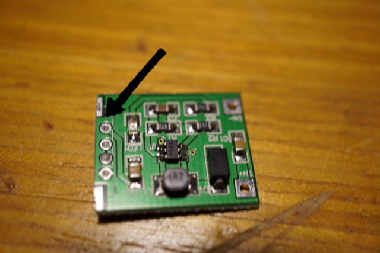\
*Pic. 13: There! It's that round spot where the trace leads away to the
resistor.*
* * *

Next, solder two **black cables** to **In-**. Solder one of them to **GND**
on the **MPU6050**. Leave the other for the **Arduino**.

#### 2.4.5.2 MPU6050

Now, solder four cables onto the **MPU6050**, one onto **VIN**, one onto
**SCL**, one onto **SDA** and another onto **INT**. Keep them short.

#### 2.4.5.3 Arduino

Have the **red cable** stick through **VIN** and the **black cable** stick
through **GND** on the **Arduino**. Have the cables coming from **SCL**,
**SDA** and **INT** stick through **A5**, **A4** and **D2**, respectively.

Now solder them on from above.

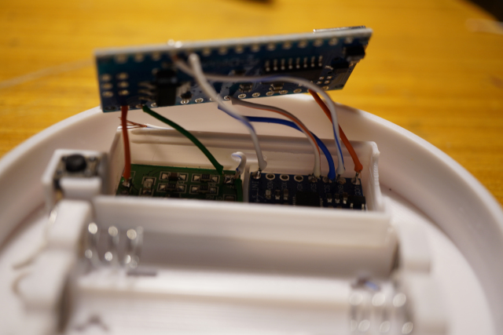\
*Pic. 14: That looks about right. Maybe you can get those cables a bit
shorter. It's a tight fit here, but it works. Fold them in carefully.*
* * *

#### 2.4.5.4 32 addressable LED strip

Next, find that oval hole between the **Arduino** and the **MPU6050**.
We'll use it to route the cables for the **LED strip** through it. But
first, we'll prepare the **LED strip**.

Solder three spots onto the **32 addressable LED strip**. Note the
direction of the arrows on the strip and solder the spots on the right end.
If the arrow points to the end of the strip, it's the wrong end.

\
*Pic. 15: Solder the spots onto the back.*
* * *

Place the **LED strip** around the inside of the fidget's top part. Start
with the centre of the first LED at **9 o'clock** and continue
**clockwise**. **9 o'clock** is where the oval hole is located.

Now, solder a **red** cable to **+5V**, a **black** cable to **GND** and a
different coloured cable to **D6** on the **Arduino**. Now, route them
through that oval hole. Then solder them to **Plus (+)**, **DATA** and
**Minus (-)** on the LED strip, respectively; that is, the top most solder
spot is **Plus (+)**, the middle one is **DATA** and the lowest one is
**Minus (-)**.

### 2.4.6 Software

Copy or link the folder in `arduino-solarfidget/libraries/solarfidget` into
your `Arduino/libraries` folder.

Place the files at:
<https://github.com/jrowberg/i2cdevlib/tree/master/Arduino/I2Cdev>
in a subdirectory in your `Arduino/libraries` folder

Place the files at:
<https://github.com/jrowberg/i2cdevlib/tree/master/Arduino/MPU6050>
in a subdirectory in your `Arduino/libraries` folder

Place the files at:
<https://github.com/adafruit/Adafruit_NeoPixel>
in a subdirectory in your `Arduino/libraries` folder

Open the **Arduino IDE** and load the file:
`arduino-solarfidget/arduino-solarfidget.ino`

Place the fidget on a level surface and connect it to your computer. Open
the serial monitor. Compile and upload the programme to the **Arduino**.
Wait for the **Arduino** to reset and start. Look at the serial monitor and
note down the **calibration values**.

Now, in the file:
`arduino-solarfidget/arduino-solarfidget.ino` find the following line:

```
#define SERIAL_DEBUG
```

Comment out this line so that it looks like this:

```
//#define SERIAL_DEBUG
```

Find and uncomment the line:

```
//#define FIDGET 1
```

Now, find the lines:

```
#if (FIDGET == 1)
    // Fill in your calibration values here
    mpu.setXAccelOffset(0);
    mpu.setYAccelOffset(0);
    mpu.setZAccelOffset(0);
    mpu.setXGyroOffset(0);
    mpu.setYGyroOffset(0);
    mpu.setZGyroOffset(0);
#endif
```

and replace the **0 values** with the values you just noted down for Gyro
and Accel.

Then, comment the following line:

```
#define AUTO_OFF
```

We don't want the fidget to turn off the light. If we don't want to play
with the fidget, we'll turn it off with the on/off mechanism.

Save the file and upload the programme again.

Finally make sure the LED strip is placed correctly in the fidget and the
light of the pendulum is at the right spot. Do this by holding the fidget
askew and wait for the pendulum to rest. Now, move the strip either left
or right to bring the light into the correct position.

After that, push the **Arduino** into its place.

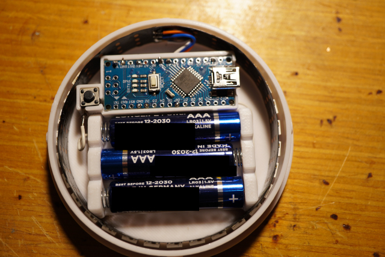\
*Pic. 16: All done. Batteries inserted.*
* * *

You should all be set now. Have fun travelling our solar system.

