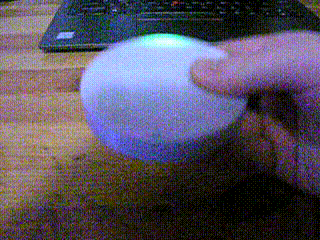
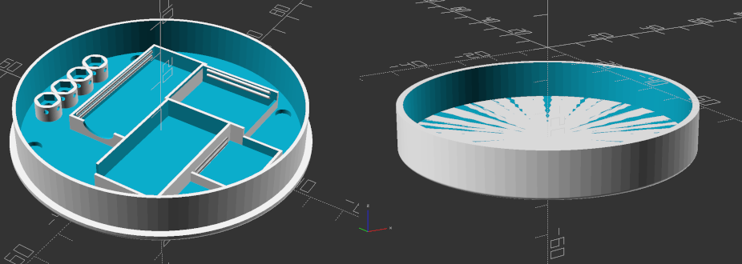
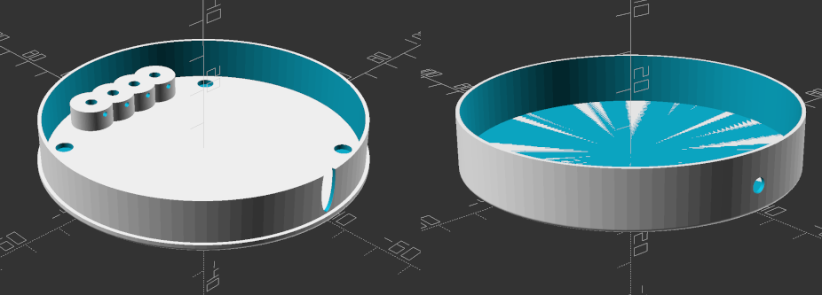
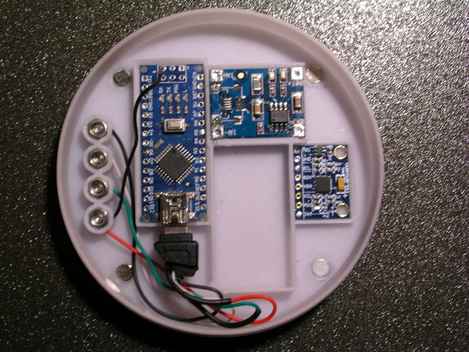
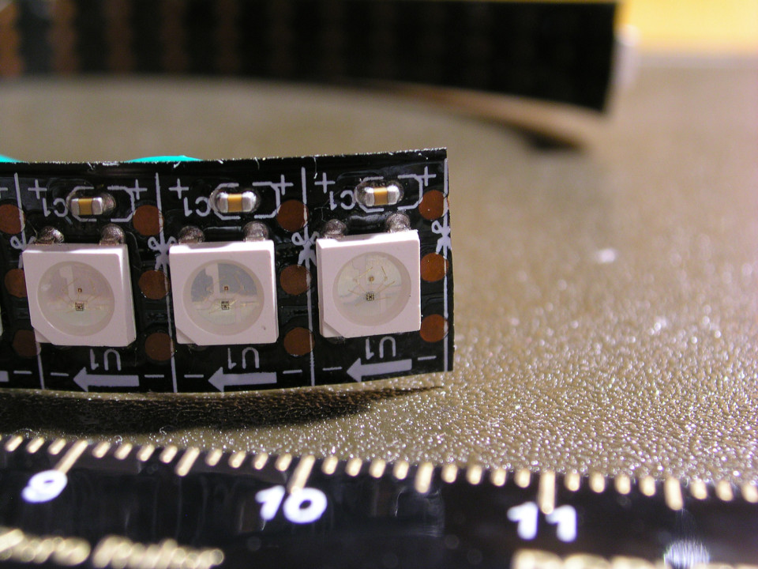
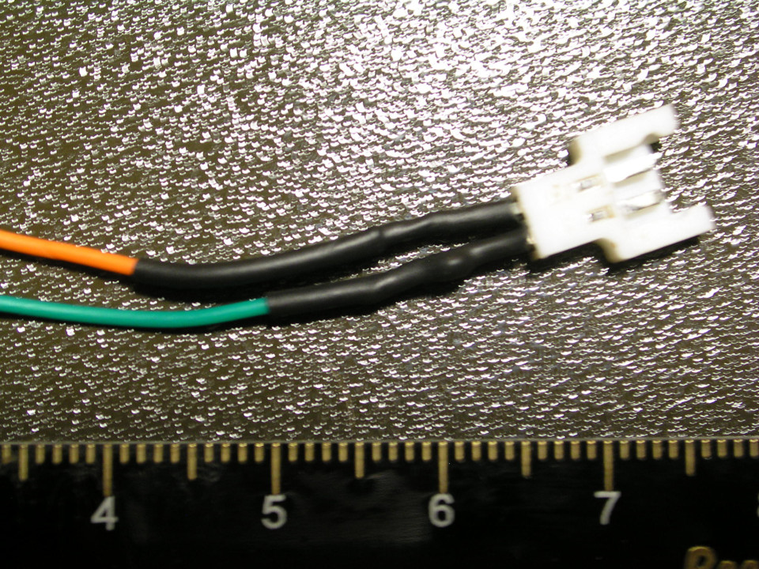
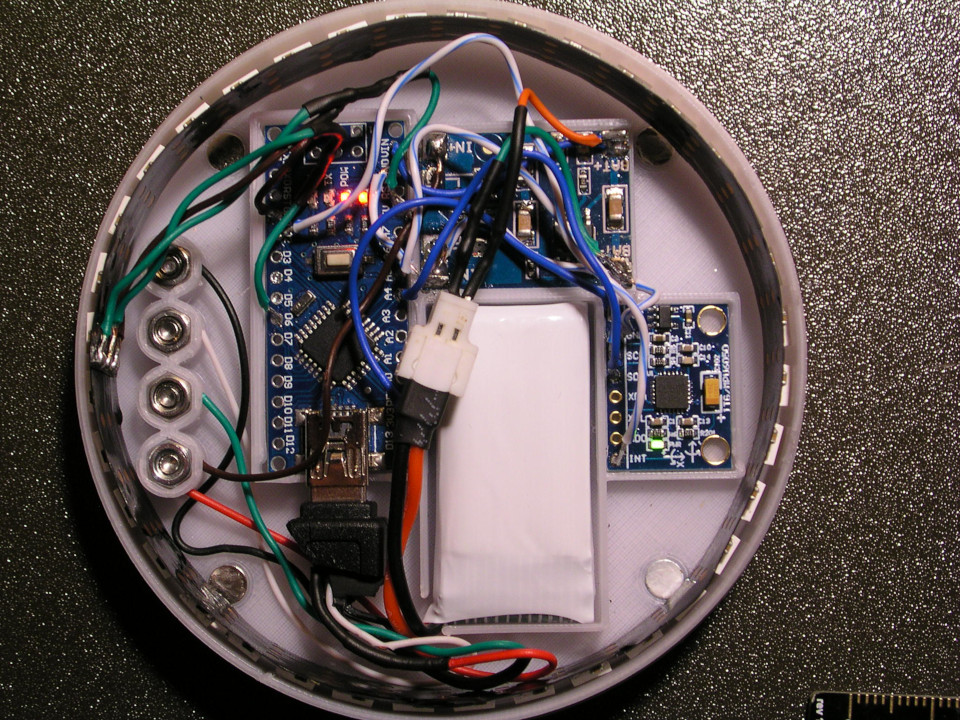
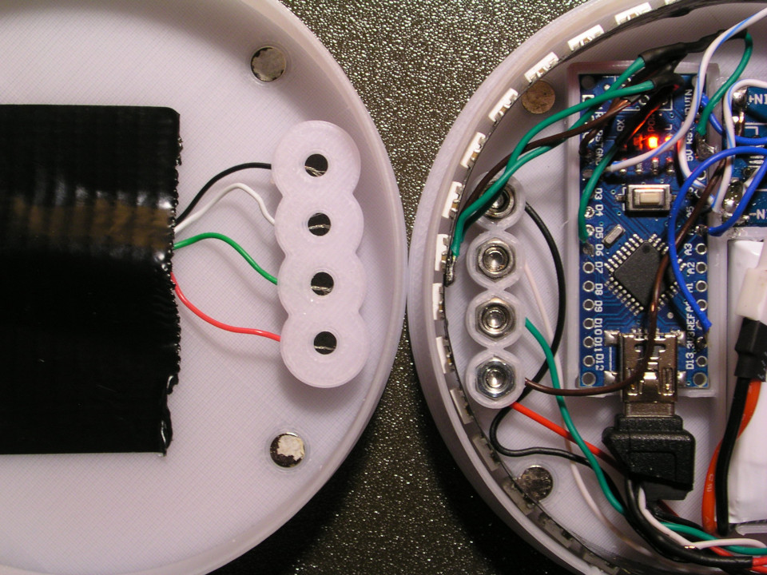
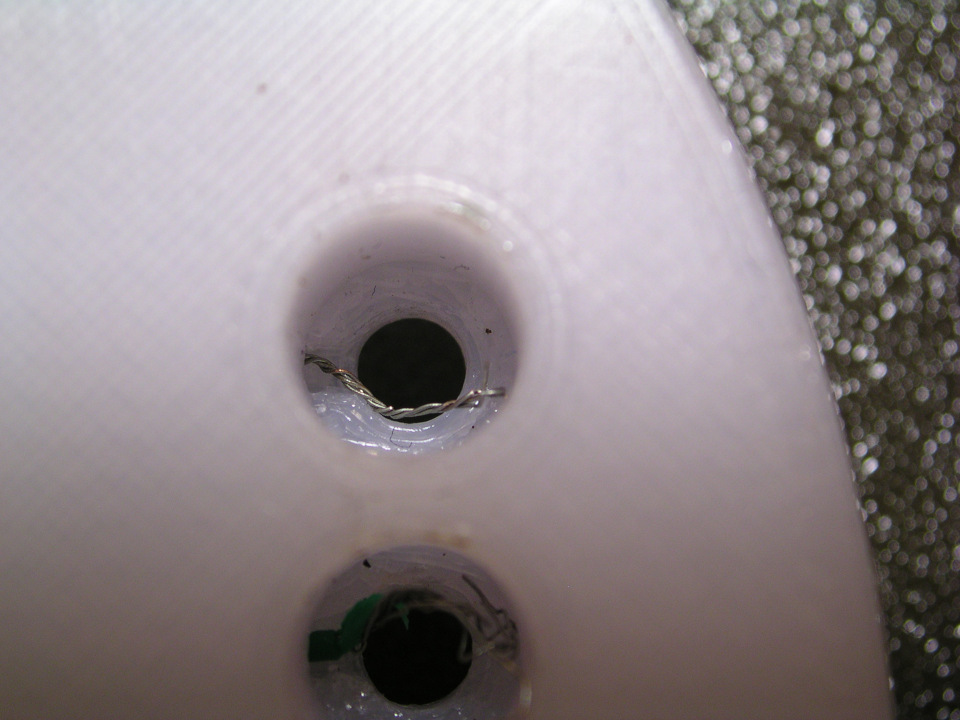
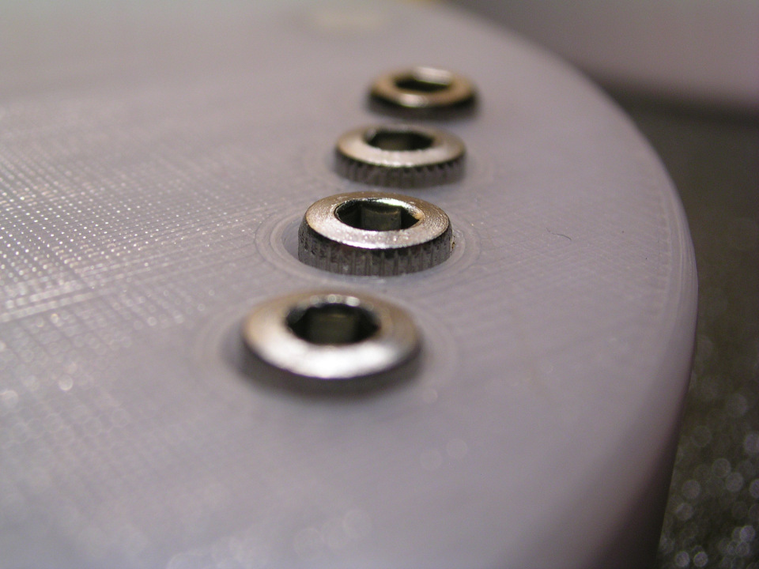

# 		ORIGINAL SOLARFIDGET
### 	An Arduino Project for a light spinning fidget

Concept, Design and Idea (C) 2021 Kurt Manucredo, under the
Creative Commons Attribution-NonCommercial 3.0 Unported License

For more information on Copyright please refer to the respective files and
the LICENSE-* files.


* * *

##		THE ORIGINAL SOLARFIDGET

Using an LED-Ring (of 36 rgb leds) and an MPU6050 gyro/accel, this
fidget calculates the position of a rotating pendulum that reacts to
acceleration and gravity and simulates the effect of gravity on different
bodies in our solar system (including Pluto).

# 1. MANUAL INSTRUCTIONS

\
*To travel from planet to planet hold the fidget horizontally, turn it
twice by 180 degrees. If there is no change, try doing it faster.*
* * *

\
*To turn off the lightfidget hold the fidget horizontally, turn it thrice
by 180 degrees. If there is no change, try doing it faster.*

# 2. HOW TO BUILD ONE FOR YOURSELF

## 2.1 PARTS NEEDED

- 1x Arduino Nano
- 1x MPU6050 breakout board
- 1x battery charging breakout board
- 1x 36 addressable LEDs stripe (\*)
- 1x HS170 380mAh LiPo battery with Molex plug
- 1x male Molex plug (\*\*)
- 1x 3d-printed models of both the fidget and charger parts (\*\*\*)
- 1x USB mini cable
- 4x 0.3x4x5 mm compressing spring
- 4x M3 locknut
- 4x M3 nut
- 4x M3x10mm bolt
- 4x M3x4mm bolt
- 8x cylinder magnet d=5mm,h=2.7mm,
- and a punch of cables one can salvage from old LAN cables or similar.

> (\*):     Use a stripe with a LED density of **144 LEDs per metre**.\
> (\*\*):   When buying a set of batteries there is normally a charger
>           included from which you can salvage male Molex plugs.\
> (\*\*\*): all four parts can be found as .3mf files in the
>           design-solarfidget folder and can be imported directly into
>           the 3d slicer software. If you need to make changes to
>           accommodate your own hardware, use the solarfidget.scad file
>           to do so.

## 2.2 OPENSCAD RENDERINGS

\
*Fig. 1: The two parts pictured above compose the solarfidget*
* * *

\
*Fig. 2: These two parts compose the charger.*
* * *

## 2.3 BUILD INSTRUCTIONS

### 2.3.1 Magnets

Place all eight magnets inside the charger and fidget so that the fidget
and charger will only lock in place when the fidget is placed on top of
the charger in the correct orientation; for example: place the magnets,
next to the charger towers, with the same pole facing down. Do the opposite
for the other two magnets. Repeat for the charger but reverse the poles.
Use a crooked M6 key, place the magnet on the crooked end and use a
hammer to fix the magnets in place.

### 2.3.2 USB mini cable

Cut the USB mini cable about 10cm from the mini USB plug side. Carefully
remove the PVC coat and the shielding. There should be four cables: one
**black**, one **red**, one **white** and one **green**. Also remove as
much of the hard plastic from the mini USB plug as possible - we only
have limited space - but don't break the plug. Also make sure both the
**red** and **black** cables are **+5V** and **GND**, respectively.

### 2.3.3 Fidget

Now, we will work on the part of the fidget that houses all the
electronics, that is, the top part.

Place the top part of the fidget in front of you facing the inside and
having the charging towers face left. Connect the cables of the mini USB
plug as follows from top to bottom: **black**, **white**, **green**,
**red**; and add one cable to the red cable; there is an extra hole for
that. Later, solder this cable to the battery charging breakout board and
ground the board on the Arduino.

Use the **M3 nuts** and **M3x4mm bolts** to secure the cables. Clean the
inside of the towers if there is loose or deformed material inside from
printing the overhang. Use a **longer** M3 bolt to drive the nut into its
place, enough so, that you can still push the cable into the hole below
the nut. Then drive the nuts down all the way and secure the cables. Make
sure there is **only blank wire** between the nut and the tower. Keep the
blank wire **short**. If it's too long it may curl up around the bold,
when fixing it, which we don't want to happen.

Connect the Arduino Nano to the mini USB plug. Push the Arduino inside its
proper place. Push the battery charging breakout board into its proper
place. Finally push the MPU6050 breakout board into its proper place,
next to the battery, on the right side. Have the MPU6050 **face up**. On
the MPU6050 have the **X-axis** point to the **right and left**.

\
*Fig. 3: Magnets and hardware installed. Arduino plugged in.*
* * *

### 2.3.4 LED stripe

Solder three cables onto the 36 addressable LED stripe. Note the direction
of the arrows on the stripe and solder the cables on the right end. If the
arrow points to the end of the stripe, it's the wrong end.


\
*Fig. 4: This is the right end. Solder the cables on to the back,
pointing into the direction of the arrows. You can see a green cable stick
out above in the picture.*
* * *

Place the stripe around the inside of the fidget's top part. Start around
the middle of the charging towers and continue **clockwise**.

### 2.3.5 Let's wire it all up:

Wire all cables around the battery compartment when you solder them on.
Make sure there will be enough place for the LED stripe around the inside
of the fidget, should you remove the stripe while you solder the rest.
Keep the cables as short as possible.

As I have mentioned before, at the beginning, solder the extra cable we
add to the charging tower to **IN+** on the battery charging breakout
board. Don't forget to **ground** the battery charging breakout board.

Solder **BAT+** and **BAT-** from the battery charging breakout board to
**VIN** and **GND** on the Arduino, respectively. Make sure your Arduino
can run with *3.7V*. Mine was meant for 5V but it works quite well for a
few hours. 

Solder **VIN** and **GND** from the MPU6050 to **3V3** and **GND** on the
Arduino, respectively. Now, solder **SCL**, **SDA** and **INT** from the
MPU6050 to **A5**, **A4** and **D2** on the Arduino, respectively. On the
Arduino I used, **A5** and **A4** are for **SCL** and **SDA**. Your
Arduino may differ.

Solder two cables to the **male MOLEX plug**. When you connect a battery
to the plug, you can see which cable is which. Make sure the plug and
cable are properly isolated. Use **shrink tubing**. ***Never solder with a
connected battery!***

\
*Fig. 5: Male Molex plug.*
* * *

Solder the two cables to **BAT+** and **BAT-** accordingly.

Now, solder **+**, **-** and **DATA** from the addressable LED stripe to
**5V**, **GND** and **D6** on the Arduino, respectively.

Now, connect the battery to the MOLEX plug and place it inside the fidget.

\
*Fig. 6: This is about what it should look now.*
* * *

### 2.3.6 Charging station

Fix up the charging station by placing the four cables from the cut-off
end of the USB cable inside the charging towers of the charging station.
**Don't forget** to route the cable through the bottom part of the charger
station first, before you wire it all up.

\
*Fig. 7: That's how we figure out which cable goes where. Fix the cable
with tuck tape.*
* * *

Use the **0.3x4x5 mm compressing springs**, the **M3 locknuts** and the
**M3x10mm bolts** to finish up the charger. Have the springs push down on
the **blank wires** inside the towers. Clean the inside of the towers if
needed.

\
*Fig. 8: Here you see the blank wire inside the charger tower.*
* * *

Have the bolts look out
of the charger a bit so that the fidget gets good contact when pushed down
by the magnets.

\
*Fig. 9: Here you see the bolts looking out a little. Have them look out
as little as possible, but make the charger work.*
* * *

Before we close up the fidget we need to do the software and fine-tune the
position of the LED stripe.

### 2.3.7 Software

Copy or link the folder in `arduino-solarfidget/libraries/solarfidget` into
your `Arduino/libraries` folder.

Place the files at:
<https://github.com/jrowberg/i2cdevlib/tree/master/Arduino/I2Cdev>
in a subdirectory in your `Arduino/libraries` folder

Place the files at:
<https://github.com/jrowberg/i2cdevlib/tree/master/Arduino/MPU6050>
in a subdirectory in your `Arduino/libraries` folder

Place the files at:
<https://github.com/adafruit/Adafruit_NeoPixel>
in a subdirectory in your `Arduino/libraries` folder

Open the Arduino IDE and load the file:
`arduino-solarfidget/arduino-solarfidget.ino`

Place the fidget on top of the charger, the charger on a level surface and
connect it to your computer.
Open the serial monitor. Compile and upload the programme to the Arduino.
Wait for the Arduino to reset and start. Look at the serial monitor and
note down the **calibration values**. Now, open the file:
`arduino-solarfidget/arduino-solarfidget.ino` and find the follwoing
lines:

```
mpu.CalibrateAccel(6);
mpu.CalibrateGyro(6);
mpu.PrintActiveOffsets();
```

Comment those lines and uncomment the lines above starting with mpu.set???
and replace the values you just noted down for Gyro and Accel. Save the
file and upload the programme again.

Finally make sure the LED stripe is placed correctly in the fidget and the
light of the pendulum is at the right spot. Do this by holding the fidget
askew and wait for the pendulum to rest. Now, move the stripe either left
or right to bring the light into the correct position.

After that, slide the other part of the fidget on.

You should all be set now. Have fun travelling our solar system.

