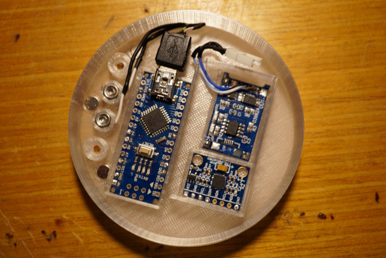

# 		ORIGINAL SOLARFIDGET

Using an LED-Ring (of 32 rgb leds) and an MPU6050 gyro/accel, this
fidget calculates the position of a rotating pendulum that reacts to
acceleration and gravity and simulates the effect of gravity on different
bodies in our solar system (including Pluto).

Concept, Design and Idea **(C)** 2021-2022 Kurt Manucredo, under the
CREATIVE COMMONS ATTRIBUTION-NONCOMMERCIAL 4.0 INTERNATIONAL PUBLIC LICENSE

For more information on Copyright please refer to the respective files and
the LICENSE-* files.


* * *

# 1. MANUAL INSTRUCTIONS

## 1.1 TRAVEL FROM PLANET TO PLANET

You can travel the following bodies in our solarsystem in order:

- Mercury (0.38g)   (white)
- Venus   (0.904g)  (light blue)
- Earth   (1g)      (dark blue)
- Mars    (0.3794g) (red brown)
- Jupiter (2.528g)  (white grey)
- Saturn  (1.065g)  (yellow)
- Uranus  (0.886g)  (violet)
- Neptune (1.14g)   (green)
- Pluto   (0.063g)  (pink)

\
*To travel from planet to planet hold the fidget horizontally, turn it
twice by 180 degrees. If there is no change, try doing it faster.*
* * *

## 1.2 TURN THE LIGHT ON AND OFF

\
*To turn the lightfidget on or off hold the fidget horizontally, turn it
thrice by 180 degrees. If there is no change, try doing it faster.*

* * *

# 2. HOW TO BUILD ONE FOR YOURSELF

## 2.1 PARTS NEEDED

- 1x Arduino Nano or compatible
- 1x MPU6050 breakout board
- 1x TP4056 battery charging breakout board
- 1x 32 addressable LEDs strip (\*)
- 1x 44x24.5x9mm 750mAh LiPo battery with Molex plug
- 1x male Molex plug (\*\*)
- 1x 3d-printed models of both the fidget and charger parts (\*\*\*)
- 1x USB mini cable
- 4x 0.3x4x5 mm compressing spring
- 4x M3 locknut
- 4x M3 nut
- 4x M3x10mm bolt
- 4x M3x4mm bolt
- 8x cylinder magnet d=5mm,h=2mm,
- and a punch of cables one can salvage from old LAN cables or similar.

> (\*):     Use a strip with an LED density of **144 LEDs per metre**.\
> (\*\*):   When buying a set of batteries there is normally a charger
>           included from which you can salvage male Molex plugs.\
> (\*\*\*): all four parts can be found as .3mf files in the
>           design-solarfidget folder and can be imported directly into
>           the 3d slicer software. If you need to make changes to
>           accommodate your own hardware, use the solarfidget.scad file
>           to do so.

## 2.2 OPENSCAD RENDERINGS

\
*Pic. 1: The four parts pictured above compose the solarfidget and the
charger*
* * *

## 2.3 BUILD INSTRUCTIONS

### 2.3.1 Magnets

Place four magnets inside the charger and four inside the fidget so that
the both lock in place. Have the magnet's poles in the fidget all oriented
in the same direction. Reverse the poles in the charger. There is no room
for error, since you will have to destroy the parts to remove the magnets.

\
*Pic. 2: Use a crooked M6 key, place the magnet on the crooked end and use a hammer
to fix the magnets in place.*
* * *

### 2.3.2 USB mini cable

Cut the USB mini cable about 10cm from the mini USB plug side. Carefully
remove the PVC coat and the shielding. There should be four cables: one
**black**, one **red**, one **white** and one **green**. Also remove as
much of the hard plastic from the mini USB plug as possible - we only
have limited space - but don't break the plug. We won't be using the
**red** or the **black** cable. If you messed them up, we are still good to
go.

### 2.3.3 Fidget

Now, we will work on the part of the fidget that houses all the
electronics, that is, the top part.

Place the top part of the fidget in front of you, facing the inside and
having the charging towers face up. Connect the two cables of the mini USB
plug as follows from left to right (leave the first and fourth empty):
**white**, **green**

Add a red cable for **+5V** to the first tower and a black cable to the
last tower for **GND**.

Use the **M3 nuts** and **M3x4mm bolts** to secure the cables. Clean the
inside of the towers if there is loose or deformed material inside from
printing the overhang. Push the nuts inside the towers.

Make sure there is **only blank wire** between the nut and the tower. Keep
the blank wire away form the bold. We don't want the wire to curl around
the bolt.

Before we can install the battery charging breakout board, we need to get
rid of the USB plug:

\
*Pic. 5: Charging breakout board with the USB plug.*
* * *

\
*Pic. 6: Charging breakout board with the USB plug removed.*
* * *

Connect the Arduino Nano to the mini USB plug. Push the Arduino inside its
proper place. Push the battery charging breakout board into its proper
place. Finally push the MPU6050 breakout board into its proper place. Have
the MPU6050 **face up**. On the MPU6050 have the **X-axis** point to the
**right and left**.

\
*Pic. 3: Magnets and hardware installed. Arduino plugged in.*
* * *

### 2.3.4 LED strip

Solder three spots onto the 32 addressable LED strip. Note the direction of
the arrows on the strip and solder the spots on the right end. If the arrow
points to the end of the strip, it's the wrong end.


\
*Pic. 4: Solder the spots onto the back.*
* * *

Place the strip around the inside of the fidget's top part. Start with the
first LED at **9 o'clock** and continue **clockwise**.

### 2.3.5 Soldering

Wire all cables left and right through the openings in the battery
compartment. Keep the cables as short as possible. Ground as many
components on the battery charging breakout board. All spots marked with
the **Minus (-)** are the same. Then **ground** the board to the Arduino.

#### 2.3.5.1 Battery charging breakout board

Solder the **red** cable from the charging tower to **+In** on the battery
charging breakout board. Then, solder the **black** cable to one of the
**GND**s on the Arduino.

Solder **OUT+** from the battery charging breakout board to **VIN** on the
Arduino. 

#### 2.3.5.2 MPU6050

Solder **VIN** from the MPU6050 to **3V3** on the Arduino and **ground**
the MPU6050 on the battery charging breakout board.  Now, solder **SCL**,
**SDA** and **INT** from the MPU6050 to **A5**, **A4** and **D2** on the
Arduino, respectively.

#### 2.3.5.3 MOLEX plug

Solder two cables to the **male MOLEX plug**. When you connect a battery to
the plug, you can see which cable is which. Make sure the plug and cable
are properly isolated. Use **shrink tubing**. ***Never solder with a
connected battery!*** Don't bend the cables around the solder spots at the
MOLEX plug. This will lead to broken contacts.

\
*Pic. 7: Male Molex plug.*
* * *

Solder the two cables to **BAT+** and **BAT-** on the battery charging
breakout board, accordingly. **If you do it the wrong way and connect a
battery your board will get fried and smoke will come out.**

#### 2.3.5.4 32 addressable LEDs strip

Now, solder a **red** cable to **+5V**, a **black** cable to **GND** and a
different coloured cable to **D6** on the Arduino. Then solder them to
**Plus (+)**, **DATA** and **Minus (-)**, respectively; that is, the top
most solder spot is **Plus (+)**, the middle one is **DATA** and the lowest
one is **Minus (-)**.

#### 2.3.5.5 Battery

Now, connect the battery to the MOLEX plug and place it inside the fidget.

\
*Pic. 8: This is about what it should look now.*
* * *

### 2.3.6 Charging station

**Don't forget** to route the cable through the bottom part of the charger
station first, before you continue. Clean the inside of the towers if
needed.

Use the **0.3x4x5 mm compressing springs**, the **M3 locknuts** and the
**M3x10mm bolts** to finish up the charger. Have the bolts look out of the
charger around **one mm**, enough so that the fidget gets good contact when
pushed down by the magnets. Get it right now. Later on it will be very
difficult to alter it.

\
*Pic. 9: Here you see the bolts looking out a little.*
* * *

To figure out which cable goes where place the fidget's charging towers
opposite the charging station's charging towers.

Now, wind the blank wires of the four cables around the end of the bolts.
Have as much blank wire as possible go around and make it really tight.

\
*Pic. 10: The wire is wound up around the bolts tight, so as to give a good
contact and reduce the resistance as much as possible.*
* * *

Now, apply tin-solder on all of the blank wire.

\
*Pic. 11: The wire will act as a sponge when you apply tin-solder. Apply
plenty.*

Before we close up the fidget we need to do the software and fine-tune the
position of the LED strip.

### 2.3.7 Software

Copy or link the folder in `arduino-solarfidget/libraries/solarfidget` into
your `Arduino/libraries` folder.

Place the files at:
<https://github.com/jrowberg/i2cdevlib/tree/master/Arduino/I2Cdev>
in a subdirectory in your `Arduino/libraries` folder

Place the files at:
<https://github.com/jrowberg/i2cdevlib/tree/master/Arduino/MPU6050>
in a subdirectory in your `Arduino/libraries` folder

Place the files at:
<https://github.com/adafruit/Adafruit_NeoPixel>
in a subdirectory in your `Arduino/libraries` folder

Open the Arduino IDE and load the file:
`arduino-solarfidget/arduino-solarfidget.ino`

Place the fidget on top of the charger, the charger on a level surface and
connect it to your computer.
Open the serial monitor. Compile and upload the programme to the Arduino.
Wait for the Arduino to reset and start. Look at the serial monitor and
note down the **calibration values**. Now, open the file:
`arduino-solarfidget/arduino-solarfidget.ino` and find the follwoing
line:

```
#define SERIAL_DEBUG
```

Comment out this line so that it lookes like this:

```
//#define SERIAL_DEBUG
```

Find and uncomment the line:

```
//#define FIDGET 1
```

Now, find the lines:

```
#if (FIDGET == 1)
    // Fill in your calibration values here
    mpu.setXAccelOffset(0);
    mpu.setYAccelOffset(0);
    mpu.setZAccelOffset(0);
    mpu.setXGyroOffset(0);
    mpu.setYGyroOffset(0);
    mpu.setZGyroOffset(0);
#endif
```

and replace the **0 values** with the values you just noted down for Gyro
and Accel.

If you want power saving, uncomment the following line.

```
//#define POWERSAVING
```

If in power saving mode, before you try enabling the fidget, hold it for a
few seconds in your hands. If you have trouble enabling it, just flip it
continuously by 180 degrees until it enables. Power saving mode is only
active when the fidget is off and sitting still.

Save the file and upload the programme again.

Finally make sure the LED strip is placed correctly in the fidget and the
light of the pendulum is at the right spot. Do this by holding the fidget
askew and wait for the pendulum to rest. Now, move the strip either left
or right to bring the light into the correct position.

After that, slide the other part of the fidget on.

You should all be set now. Have fun travelling our solar system.

